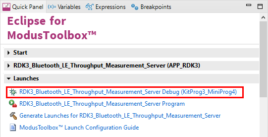

# RDK3 BLE Throughput Measurement Server

Rutronik Development Kit 3 Programmable System-on-Chip CYB06447BZI-BLD53 "RDK3 BLE Throughput Measurement Server" Code Example. 

This is a code example for the BLE 5.1 Throughput Measurement GATT server device. Two RDK3 development kits are needed for this demo to function. One functions as a GATT server and the other one as a GATT client device. 

The code example was written referring to the “CE222046 – PSoC 6 BLE Throughput Measurement”.

## Requirements

- [ModusToolbox™ software](https://www.cypress.com/products/modustoolbox-software-environment) v3.0

## The Provisioning of the RDK3

The CYB06447BZI-BLD53 device must be provisioned with **keys** and **policies** before being programmed. If the kit is already provisioned, copy-paste the keys and policy folder to the application folder. If the unsigned or not properly signed image will be written to the RDK3 PSoC™ 64 – the microcontroller will not boot. 

The “[Secure Policy Configurator](https://www.infineon.com/dgdl/Infineon-ModusToolbox_Secure_Policy_Configurator_1.30_User_Guide-UserManual-v01_00-EN.pdf?fileId=8ac78c8c8386267f0183a960762a5977)” tool is used for the provisioning of the new RDK3, please refer to the “ModusToolbox™ Secure Policy Configurator user guide”. 

The CYB06447BZI-BLD53 MCU must be powered from a 2.5V power source to be able to complete the provisioning. The RDK3 has an SMPS [Switching Mode Power Supply] which can be easily adjusted to provide 3.3V or 2.5V to the MCU by switching the slide-switch “SW1” on the bottom side of the board. 

### Using the code example with a ModusToolbox™ IDE:

1. Import the project: **File** > **Import...** > **General** > **Existing Projects into Workspace** > **Next**.
2. Select the directory where **"RDK3_BLE_Throughput_Measurement_Server"** resides and click  **Finish**.
3. Update the libraries using a **"Library Manager"** tool.
4. Select and build the project **Project ** > **Build Project**.

### Operation

The GATT server startups with the advertisement of the custom Throughput Service and Bluetooth Address 00:A0:50:AA:BB:FF. If a client device finds the address online it connects to the server. The server device starts notifying the client: 

### Debugging

If you successfully have imported the example, the debug configurations are already prepared to use with a the KitProg3, MiniProg4, or J-link. Open the ModusToolbox™ perspective and find the Quick Panel. Click on the desired debug launch configuration and wait for the programming to complete and the debugging process to start.

## Legal Disclaimer

The evaluation board including the software is for testing purposes only and, because it has limited functions and limited resilience, is not suitable for permanent use under real conditions. If the evaluation board is nevertheless used under real conditions, this is done at one’s responsibility; any liability of Rutronik is insofar excluded. 

